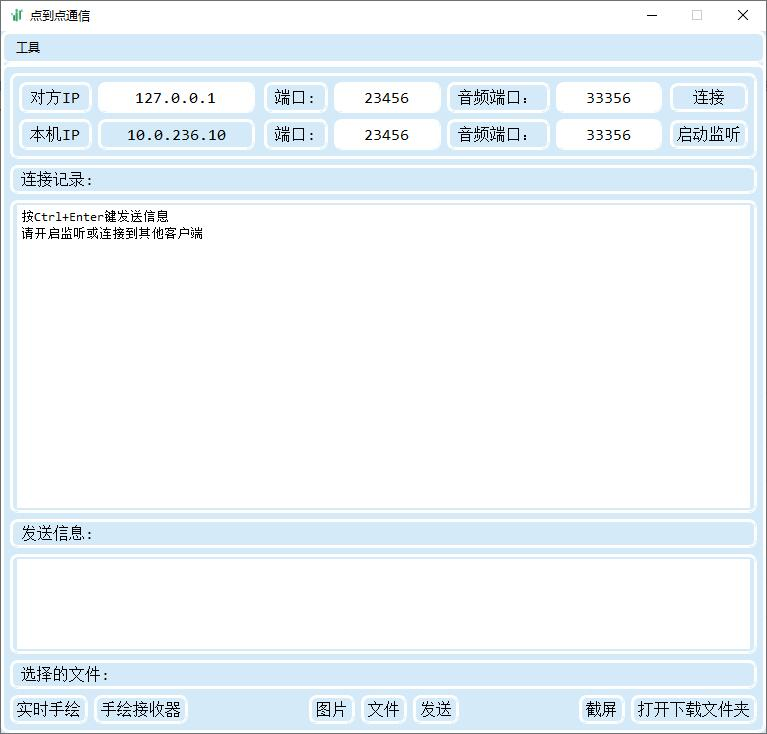
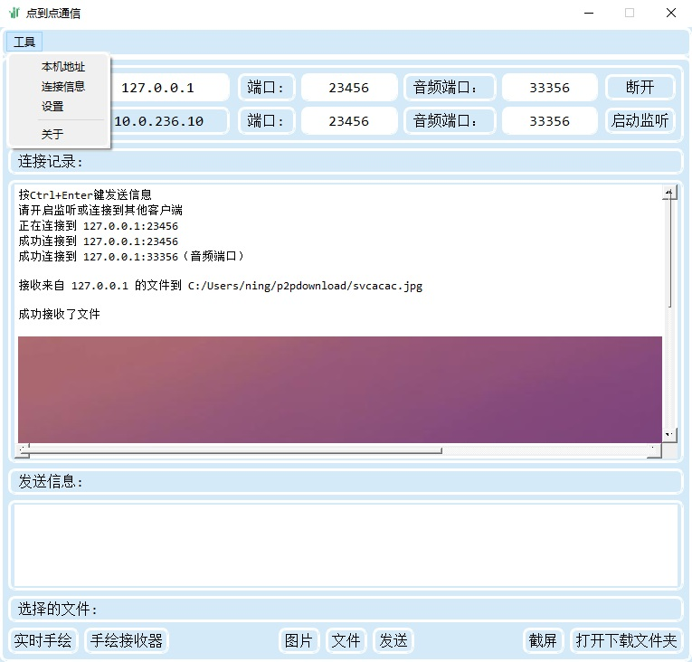
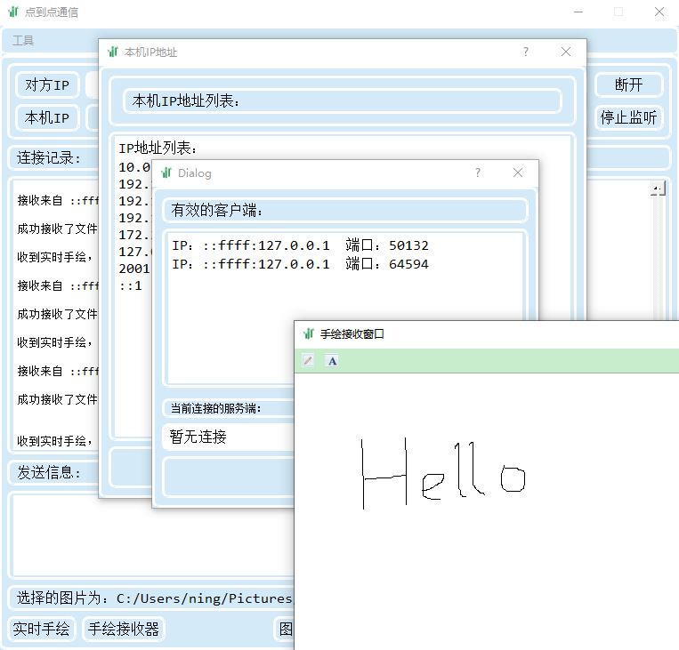

## 计算机网络实验设计：利用 Socket 实现双机通信

实验目的：利用 Socket 来实现双机通信，理解 TCP 状态机图

实验内容：使用 Socket 编程，采用其中的 TCP 面向连接方式，实现计算机数据的交换。

#### 简介

使用 QT 实现的 Socket 通信，具有超文本传输、文件传输及UDP语音传输功能，可以进行实时手绘、发送桌面截图，支持 IPv6 ，可以进行多点之间的连接。

#### 运行环境

得益于 QT 的特性，本项目程序可以在 Windows、Ubuntu、Android 下运行，测试包见 [releases](https://github.com/ningzichun/socket/releases) 页面。

#### 软件截图

主窗口

发送图片

小工具及多点连接

#### 

